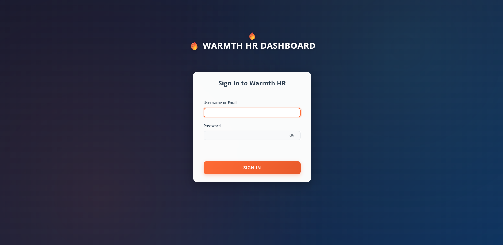
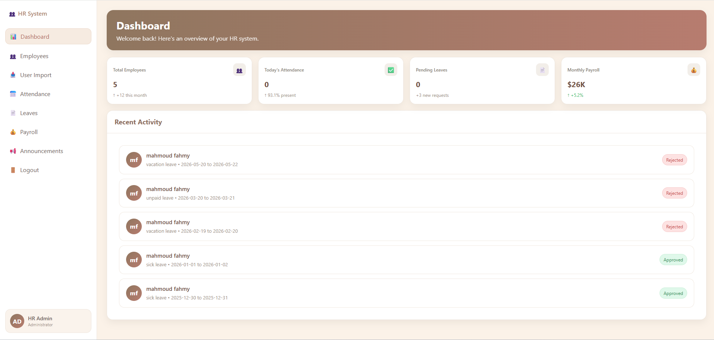
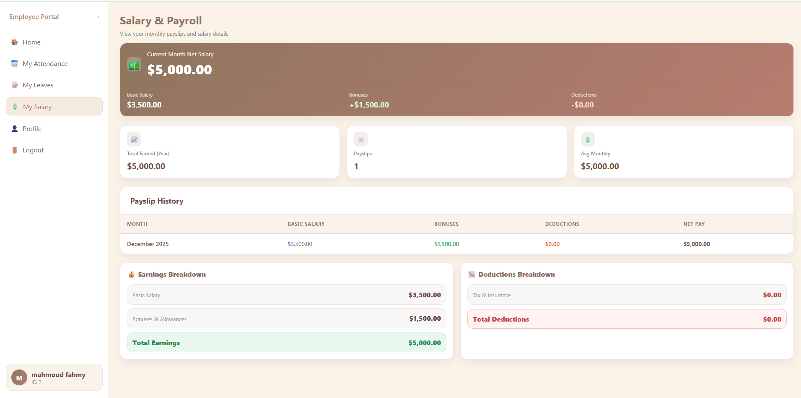
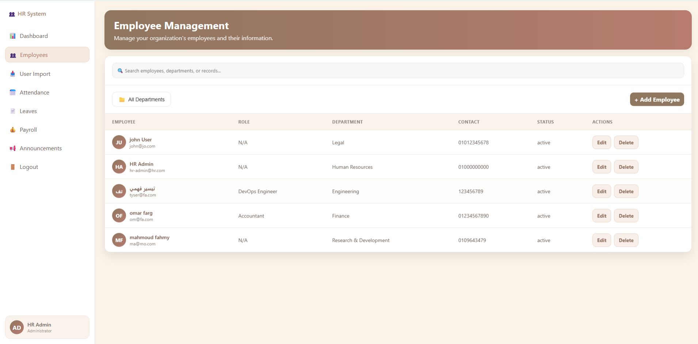

# 🎨 Warmth HR Dashboard System
> A modern, elegant, and user-friendly HR Management System interface designed with warmth and professionalism in mind.


---

## ✨ Features

### 🔐 Admin Panel
- **Dashboard Overview** - Quick stats cards (employees, attendance, leaves, payroll)
- **Employee Management** - Full CRUD operations with data tables
- **Leave Requests** - Review and approve/reject employee requests
- **Attendance Logs** - Track and filter attendance records
- **Reports & Analytics** - Generate insights and export data
- **System Settings** - Configure system preferences

### 👤 Employee Portal
- **Personal Dashboard** - View attendance status and leave balance
- **Leave Management** - Submit and track leave requests
- **Attendance History** - Calendar and list view of attendance
- **Salary Slips** - View and download monthly payslips
- **Profile Management** - Update personal information
- **Notifications** - Stay updated with company announcements

---

## System Architecture

The system is designed according to the multi-layer secured architecture specified in the project requirements, consisting of four main components:

1. **Frontend Application**  
   Server-side rendered views using Flask templates (HTML, CSS) with client-side Keycloak integration via Authorization Code Flow  
   Responsible for user interaction only. Never handles or stores passwords. Redirects users to Keycloak for authentication using the **Authorization Code Flow**.

2. **Backend (API)**  
   Built with Flask (Python)  
   Acts as a resource server. Validates incoming requests by:  
   - Verifying JWT token signature  
   - Checking token expiration  
   - Enforcing role-based access control based on roles from Keycloak  
   Only validated requests can access business logic and the database.

3. **Database Management System**  
   Uses [PostgreSQL / MySQL / etc. – اكتب اللي استخدمتوه].  
   Contains application data (at least 3 related tables with full CRUD operations).  
   Accessed exclusively by the backend after successful JWT validation. Never directly accessed by the frontend.

4. **Keycloak (Centralized IAM Server)**  
   Manages digital identity, authentication, and authorization.  
   Issues signed JWT access tokens after successful login.  
   Handles user management, roles, and custom login theme.

**Authentication & Authorization Flow**  
- User clicks login → Frontend redirects to custom Keycloak login page  
- After successful login → Keycloak redirects back with authorization code  
- Backend exchanges code for JWT access + refresh tokens  
- Frontend stores access token and attaches it in `Authorization: Bearer <token>` header for all API calls  
- Backend validates token on every request and enforces RBAC  
- Proper HTTP status codes returned: 200 OK, 201 Created, 401 Unauthorized, 403 Forbidden

This ensures full separation between authentication, authorization, business logic, and data storage.


## 🔐 Keycloak Setup (Docker + Realm Import)

To run the project with authentication using Keycloak:

### 1️⃣ Prerequisites

* Install **Docker Desktop** and ensure it is running
* Port `8080` should be free (for Keycloak)

### 2️⃣ Run Keycloak Container

```powershell
docker run --name keycloak -p 8080:8080 `
  -e KEYCLOAK_ADMIN=admin `
  -e KEYCLOAK_ADMIN_PASSWORD=admin `
  quay.io/keycloak/keycloak:22.0.1 start-dev
```

**Access the Admin Console:**
* URL: http://localhost:8080
* Login credentials:
  * **Username:** `admin`
  * **Password:** `admin`

### 3️⃣ Import Pre-configured Realm

1. Place the `hr-realm.json` file in your project folder
2. Run the import command:

```powershell
docker run --name keycloak -p 8080:8080 `
  -v ${PWD}:/opt/keycloak/data/import `
  -e KEYCLOAK_ADMIN=admin `
  -e KEYCLOAK_ADMIN_PASSWORD=admin `
  quay.io/keycloak/keycloak:22.0.1 start-dev --import-realm
```

This will import the **HR-System Realm** with all clients, roles, and basic configuration.

## OR  3. Start Keycloak
```bash
docker-compose up -d
```

## 4. Import Configuration
1. Open: http://localhost:8080/admin
2. Login: admin/admin
3. Create Realm → Import `keycloak-config/HR-System-realm.json`


### 4️⃣ Optional: Export Realm (Backup)

If you want to back up the current Realm:

```powershell
docker exec keycloak /opt/keycloak/bin/kc.sh export --realm HR-System --file /tmp/hr-realm.json
docker cp keycloak:/tmp/hr-realm.json .
```

> **Note:** Replace `keycloak` with your actual container name if different.

### 5️⃣ Access Keys for Frontend / Backend

* **Frontend Client:** `hr-frontend` (OpenID Connect)
* **Backend Client:** `hr-backend` (OpenID Connect, secret enabled)
* Use the credentials from the imported Realm JSON


## Roles Description
Here are the descriptions of the three roles used in our HR Management System. These roles are created and managed in Keycloak, assigned to users, and enforced in the backend APIs for role-based access control (RBAC):

- **Employee**: Has read-only access. Can view data but cannot create, update, or delete any records.
- **HR Officer**: Can perform create, read, and update operations. Cannot delete any records.
- **HR Admin**: Has full CRUD access (Create, Read, Update, Delete). Can perform all operations without restrictions.

## Test User Credentials
Use these test accounts to log in via the custom Keycloak login page. These users were imported from the Excel file using Keycloak's bulk import tools / Admin REST API. Each user is assigned their respective role in Keycloak to allow easy testing of RBAC:

| Role        | Username | Email             | Password |
|-------------|----------|-------------------|----------|
| hr_admin    | admin    | hr-admin@hr.com   | admin123 |
| employee    | mahmoud  | ma@mo.com         | 123456   |
| hr_officer  | omar     | om@fa.com         | 123456   |

## 📸 Preview

## Screenshots of the System

### Custom Keycloak Login Page (with HR branding, logo, and custom colors)


### HR Admin Dashboard (Full CRUD access)


### HR Officer Dashboard (CRUD without Delete)


### Employee View (Read-Only)


### Access Denied: 403 Forbidden (Officer trying to delete)


### Unauthorized: 401 (No token or invalid)


### Keycloak Admin Console (Roles and Users)

---


## 👥 Authors

- **Alaa Hassn Melook** - *Initial Design* - [@alaaMelook](https://github.com/alaaMelook)
- **Nadine Rasmy** - *Initial Design* - [@nadine-rasmy23](https://github.com/nadine-rasmy23)
- **Yumna Medhat Anter** - *Initial Design* - [@YUMNAANTER0099](https://github.com/YUMNAANTER0099)
- **Manar Ahmed** - *Initial Design* - [@Manarelmaradny](https://github.com/Manarelmaradny)
- **Mahmoud zaghloula** - *Initial Design* - [@zaghloula](https://github.com/zaghloula)
- **Abdelrahman Elmoghazy** - *Initial Design* - [@abdelrahman-elmoghazy](https://github.com/abdelrahman-elmoghazy)

---

---

<p align="center">Made with ❤️ for better HR management</p>